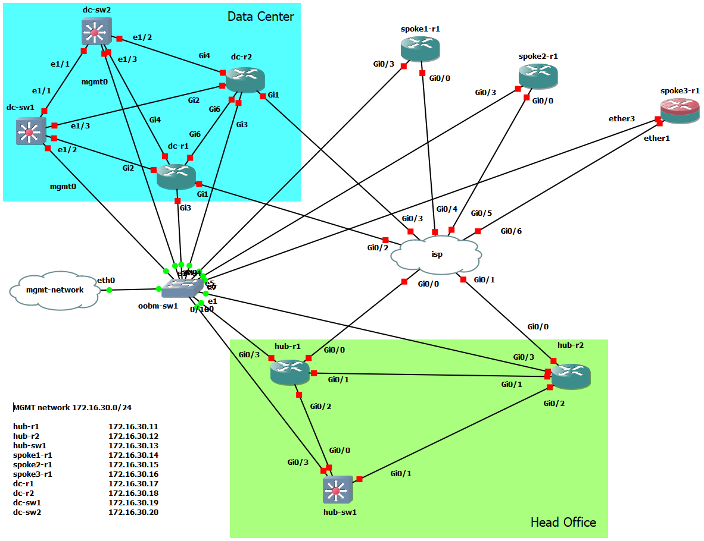

# Build Your Own Network Automation Lab Exercise
This lab were created using GNS3 application.

## Images used
### 1. Cisco L3 vios-adventerprisek9-m.vmdk.SPA.156-2.T csr1000v-universalk9.16.12.01a
### 2. Cisco L2 vios_l2-adventerprisek9-m.vmdk.SSA.152-4.0.55.E
### 3. Cisco NX-OS nxosv.9.3.1
### 4. Mikrotik chr-6.45.6

## Topology
You can find network topology scheme in topology.png file under img folder:

All devices connected using dedicated management 172.16.30.0/24 network.
Ansible VM located on the same ESXi host as GNS3 VM, and it's also connected to this network using 172.16.30.1 address.   
